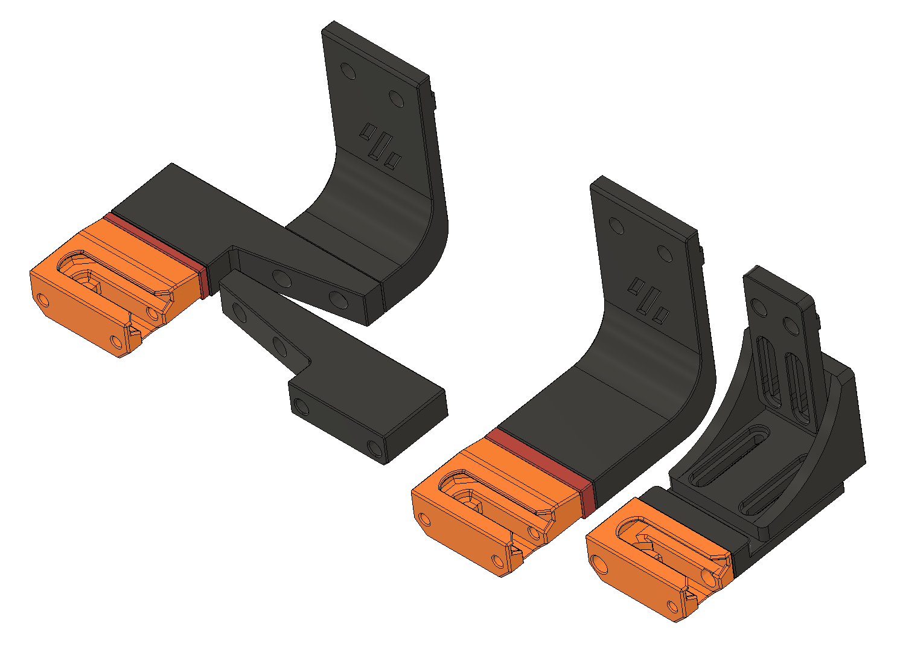

# Klicky Adapter for Euclid Probe

This is just a try to adopt the Klicky Dock mounts for Euclid.
I did not test it on a printer, just a CAD try.

The STL's have correct print orientation, you still need to use selected support, as I did not include sacrificial walls. 

